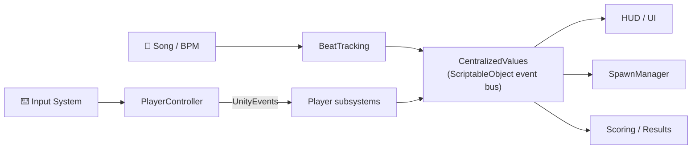

# 🎵 Ry Rush

> A rhythm-driven **first-person shooter** where damage, scoring, and enemy spawns
> are locked to the song's beat — shoot **on-beat** for bonus damage and rising combos.

<!-- TODO: Decide on a LICENSE (recommendation: "All Rights Reserved" due to third-party Asset Store content). Add badge once decided. -->

<!-- ============================================================
     HERO MEDIA
     To add the gameplay GIF when ready:
       1. Drop the file at  docs/media/hero.gif
       2. DELETE the "coming soon" placeholder 
 below
       3. UNCOMMENT the  block
     GIF tips: 5–10 s loop, on-beat shooting + combo rising + a slow-mo beat.
     Keep it SILENT (a GIF has no audio → no music-copyright concern).
     ============================================================ -->

  <i>🎬 Gameplay GIF coming soon</i>

<!--

  

-->

  <i>On-beat shots deal bonus damage — every kill rides the rhythm.</i>

<!-- Trailer link removed for now: the current trailer uses copyrighted music
     (Airbourne — "Back in the Game"), which has a Content ID claim and isn't
     suitable for a public portfolio link. To restore: re-export the trailer with
     royalty-free audio, then re-add the line below with the real URL.
     
<a href="TRAILER_URL"><b>▶ Watch the trailer</b></a>

-->

## 🎯 What makes it different

Ry Rush turns a shooter into a rhythm game. Every shot, reload, and kill is measured
against the song's beat: act **on-beat** and your damage and combo multiplier climb —
drift **off-beat** and the combo decays. Because that multiplier scales **both damage
and score**, staying in the groove is what separates scraping by from topping the
scoreboard. Aiming triggers a **slow-motion** mode that bends time (and the audio pitch)
so you can line up the next beat, while enemies are telegraphed and spawned to the rhythm.

🎶 **Bring your own music.** Load **any** song you want and play to it — the only
requirement is a **steady, constant tempo** (no tempo/BPM changes), since the beat
engine locks onto a fixed BPM.

## 📋 Project at a glance

|              |                                                                   |
| ------------ | ----------------------------------------------------------------- |
| **Role**     | Solo developer — design, gameplay programming, systems & integration |
| **Scope**    | Built alone in ~3 months (occasional help with art/assets only)   |
| **Context**  | Diploma project                                                   |
| **Engine**   | Unity 6 (6000.2.6f2) · URP 17.2                                    |
| **Language** | C# (.NET Standard)                                                |
| **Platform** | Windows (standalone)                                              |
| **Key tech** | Input System · Cinemachine 3 · UniTask · AI Navigation (NavMesh) · VFX Graph · Shader Graph |

## ✨ Features

- 🎵 **Beat-locked combat** — shooting, reloading, and dashing **on-beat** multiply your
  damage and stack combos; miss the beat and the combo bleeds away.
- 🎶 **Custom song import** — bring any track with a steady tempo; the game plays and
  scores to its BPM.
- 🏃 **Momentum movement** — jump, dash, wall-run, and wall-jump to keep your flow
  between beats.
- ⏳ **Rhythmic slow-motion** — aim to slow time and pitch the world down (the song keeps
  playing) so you can line up the next beat.
- 🤖 **State-machine enemies** — NavMesh AI that patrols, chases, and shoots, with
  physics-ragdoll deaths, spawned behind a telegraphed VFX + audio cue.
- 📊 **Beat-synced results screen** — end-of-run stats (accuracy, kills, points per
  hit/kill, on-beat actions, score) revealed in time with the music.

## 🎮 Controls

| Action                        | Keyboard & Mouse |
| ----------------------------- | ---------------- |
| Move                          | `W` `A` `S` `D`  |
| Look                          | Mouse            |
| Shoot                         | Left Mouse       |
| Aim *(also triggers slow-mo)* | Right Mouse      |
| Slow-motion                   | `Left Ctrl`      |
| Jump                          | `Space`          |
| Dash                          | `Left Shift`     |
| Reload                        | `R`              |
| Pause                         | `Esc`            |

> A gamepad is partially mapped (move, look, jump, dash, reload), but keyboard & mouse is the intended scheme.

## ▶️ Availability

> **Ry Rush is not publicly playable yet.** Several large third-party Asset Store packages
> are excluded from this repository (size + licensing), so a fresh clone won't run as-is.
> For now this repo is shared as a **code & architecture showcase** — a runnable build and
> trailer are planned once the asset/distribution setup is resolved.

## 🏗️ Architecture highlights

<!-- TODO: create ARCHITECTURE.md (deeper write-up) so the link below resolves. -->
A few patterns the project leans on:

- **Sample-accurate beat engine** — `BeatTracking` reads raw `AudioSource.timeSamples`
  (not the float `time`) and detects beats from per-song BPM/sample calibration, then
  fires beat callbacks the rest of the game listens to.
- **ScriptableObject as an event bus** — `CentralizedValues` is the single source of
  runtime state. Property setters raise `UnityEvent`s, so systems **react to changes
  instead of polling** and stay decoupled from one another.
- **Generic enemy FSM** — `Enemy_FSM<T>` + `BaseState<T>` give type-safe, per-enemy
  state machines (`Idle → Patrol ↔ Chase ↔ Walk ↔ Shoot → Dying`), tuned via a
  `ScriptableObject` data asset rather than hard-coded values.
- **Input as events** — `PlayerController` is a pure input dispatcher; movement,
  shooting, dash, reload, etc. each subscribe to a `UnityEvent` instead of reading
  input directly.
- **Mindful of allocations** — object pooling for enemies/VFX, squared-distance checks
  in the AI, and `UniTask` (low-allocation async) instead of coroutines.

## 🧠 Engineering decisions & what I learned

A solo project built in ~3 months — a lot of it was learning by doing. A few calls I'm
happy with, and a few I'd revisit:

**Decisions I'd make again**
- **A ScriptableObject event bus instead of scattered singletons.** Centralising runtime
  state in `CentralizedValues` and pushing changes through `UnityEvent`s kept UI,
  spawning, and scoring decoupled — I can add a new HUD element just by subscribing,
  without touching gameplay code.
- **A generic FSM for enemies.** Writing `Enemy_FSM<T>` / `BaseState<T>` once made every
  new enemy state a small, isolated class, and forced me to model transitions explicitly
  instead of a tangle of booleans.
- **Sample-based beat tracking.** Using `timeSamples` instead of `AudioSource.time`
  avoids float drift — which matters when the timing has to feel tight to the music.

**What I'd revisit**
- **Finish refactors I start.** Some player state currently lives in two places
  (`PlayerController` *and* `CentralizedValues`) — a migration I began but didn't finish.
  One source of truth would remove a whole class of bugs.
- **Assembly definitions & namespaces.** Everything compiles into a single assembly with
  no namespaces; splitting into modules would speed up iteration and make boundaries clear.
- **Treat timing code like it deserves tests.** The beat-synced enemy spawn once mixed
  seconds with a unitless beat-fraction — the math *looked* rhythmic but drifted off the
  beat in the back half of each bar. Tracking it down and correcting it drove the lesson
  home: with timing code, *"looks rhythmic"* isn't the same as *"is on the beat,"* and that
  kind of math earns a unit test instead of an eyeball check.

**Biggest takeaway:** decoupling pays off. The event-driven systems were easy to extend
and debug; the places that hurt were where timing, state, and side-effects got tangled.

## 🚧 Known limitations & roadmap

This is an evolving project. A few of the next steps on my list:

- **One source of truth for player state.** Finishing the `PlayerController` →
  `CentralizedValues` migration to remove duplicated state.
- **Project structure & tooling.** Introduce namespaces and assembly definitions, add a
  `.gitattributes` (Git LFS + scene merging), and clean up leftover placeholder scripts.
- **Distribution.** Resolve the excluded large assets so a runnable build can be shared.

## 🙏 Credits

Ry Rush was designed and programmed solo. It builds on third-party assets and tools —
**each retains its own license**, and **no third-party content is redistributed** through
this repository. All rights to those assets remain with their respective authors.

<!-- TODO: verify exact asset names/authors; replace the three name placeholders below. -->

**Tools & libraries**
- UniTask — Cysharp (async/await for Unity)
- StandaloneFileBrowser — in-game song import dialog
- TextMesh Pro — Unity

**Art, audio & environment**
- VFX — Gabriel Aguiar Productions
- Sci-Fi Industrial Level Kit · Sci-Fi UI
- Weapons of Choice (FREE) — Komposite Sound
- FREE Skyboxes (Sci-Fi & Fantasy)
- GeeKay3D · OccaSoftware · Wanzyee Studio · Heathen Engineering

